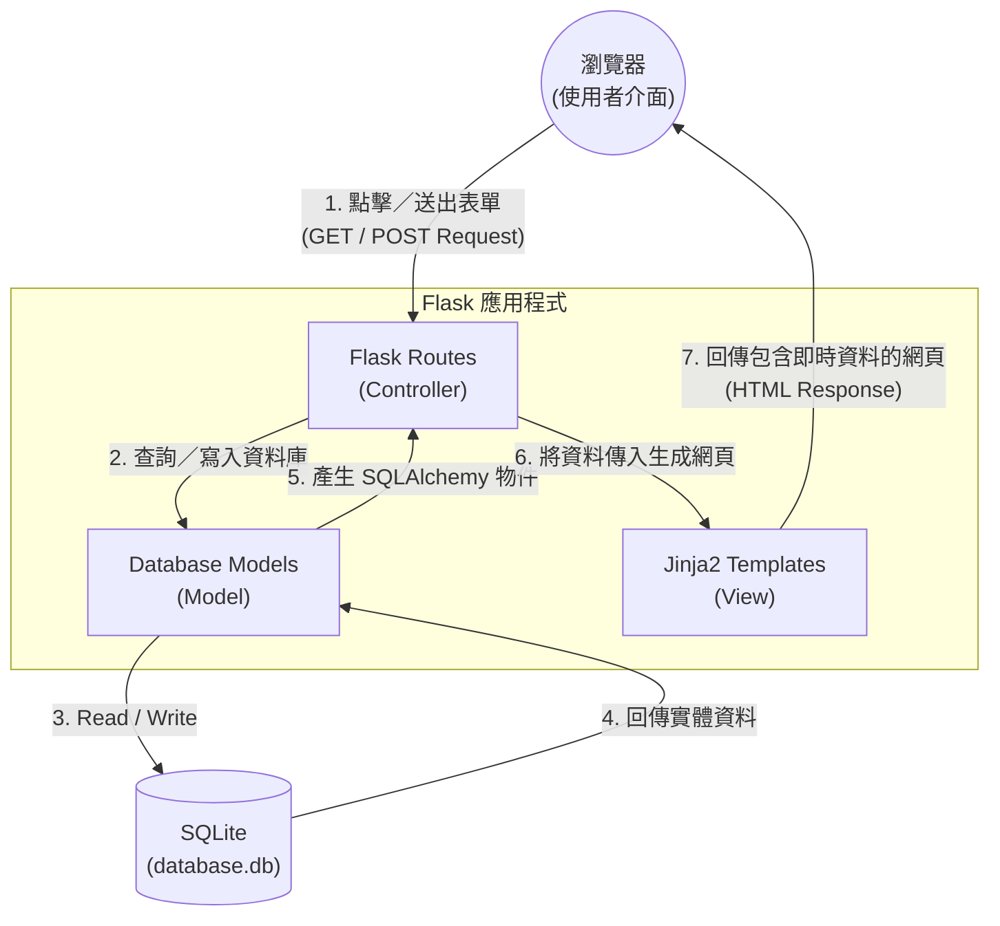

# 系統架構設計 (ARCHITECTURE)

基於「任務管理系統」需求（見 `docs/PRD.md`），以下為專案的系統與技術架構設計。
## 1. 技術架構說明

本專案定位為個人使用的輕量化任務管理工具，重點在於簡單、易維護與快速開發，因此選定以下技術組合：

- **選用技術與原因：**
  - **後端框架：Python + Flask**。Flask 是一個非常輕量、具備高彈性的微框架（Micro-framework），非常適合做為此等中小型系統 MVP 的開發基石。
  - **模板引擎：Jinja2**。基於伺服器端渲染（SSR）的設計，所有的 HTML 頁面都是由 Flask 從後端將資料與 Jinja2 模板結合後發送給瀏覽器。這樣能免除前後端分離所帶來的前端專案建置成本與複雜跳轉邏輯。
  - **資料庫：SQLite (搭配 SQLAlchemy)**。本系統預期為單一使用者，不需應付高併發的存取流量。SQLite 直接將資料庫作為單一檔案（`*.db`）儲存於本機端，不僅部屬門檻低，備份也相對容易。使用 SQLAlchemy 作為 ORM 則可避免自己手寫容易出錯的 SQL 語法，並且內建防止 SQL Injection 等安全性保護機制。

- **Flask MVC 模式說明：**
  - **Model（模型）**：負責定義資料結構（對應於 SQLite 的資料表，如 `Task`），以及如何寫入、更新和讀取任務資料。
  - **View（視圖）**：負責畫面的呈現形式。在本專案中即是指放在 templates/ 下結合 HTML 語法與 Jinja2 標籤的檔案，用以呈現任務清單、任務詳情與表單頁面。
  - **Controller（控制器）**：由 Flask 中的各個路由（Routes）來運作，負責接收來自瀏覽器的 HTTP 請求（例如使用者點擊了「新增任務」按鈕），處理對應的業務邏輯，最後決定要轉發（Render）給哪一個 View 來呈現畫面。
## 2. 專案資料夾結構

整個專案將按照 Flask 的標準佈局進行組織，使得職責分明好維護。

```text
web_app_development-main/
├── app/                         # 主要應用程式目錄
│   ├── models/                  # [Model] 資料庫模型
│   │   ├── __init__.py          # 初始化 Database 與 ORM
│   │   └── task.py              # 定義 Task 任務資料模型
│   ├── routes/                  # [Controller] Flask 路由/業務邏輯
│   │   ├── __init__.py          # 註冊所有 Blueprint 路由
│   │   └── task_routes.py       # 處理任務的 CRUD、搜尋、狀態切換
│   ├── templates/               # [View] HTML 模板（Jinja2）
│   │   ├── base.html            # 共用版型
│   │   ├── index.html           # 任務列表首頁
│   │   ├── create_task.html     # 新增任務頁面
│   │   ├── edit_task.html       # 編輯任務頁面
│   │   └── task_detail.html     # 任務詳細資訊頁面
│   ├── static/                  # 靜態資源
│   │   └── style.css            # 網頁樣式
│   └── __init__.py              # 建立 Flask app
├── instance/
│   └── app.db                   # SQLite 資料庫檔案
├── run.py                       # 專案進入點
└── requirements.txt             # 套件需求檔
```

## 3. 元件關係圖

以下展示使用者如何透過瀏覽器存取此應用程式，以及各元件（MVC）之間的連動關係。



## 4. 關鍵設計決策

1. **不採取前後端分離（使用 SSR 伺服器渲染）**
   - **考量**：考量「食譜收藏系統」多為內容清單的增刪改查，畫面互動複雜度並不像大型現代 Web 應用那樣需要依賴 React/Vue 等框架。使用傳統伺服器渲染可以大幅降低專案的初始複雜度與維護成本，符合追求快速產出可用工具的目標。

2. **選擇 SQLite 作為資料庫儲存庫**
   - **考量**：由於此系統定位為僅供我自己使用的單人工具，無大量併發流量與負載平衡的要求。SQLite 資料庫可直接以單一檔案存放於本機專案目錄中，省去了安裝 MySQL/PostgreSQL 伺服器軟體與調整連線帳號密碼的時間。

3. **使用 SQLAlchemy(ORM) 介接資料庫**
   - **考量**：即便專案規模小且使用 SQLite，但仍然可能面臨基礎的 SQL Injection 安全問題。透過 SQLAlchemy 將資料庫操作抽象為「物件導向」，不僅擁有更好的編程體驗（不用手刻生硬的 SQL 字串），未來若擴充功能而需要改為其他資料庫引擎時，也無須全盤重寫。

4. **透過 Blueprint 設計路由結構**
   - **考量**：即便是單人食譜系統，如果把所有 API 與網頁路由全部寫在一支 `app.py` 中也會變得十分凌亂。採用 Flask 的 Blueprint 機制可以依照功能領域（例如未來的標籤管理、匯入匯出模組）將路由切割至 `routes/` 資料夾，讓入口點 `app.py` 保持清爽可讀的狀態。
