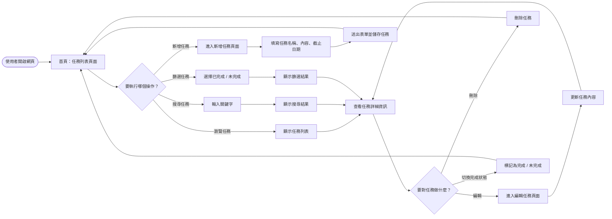
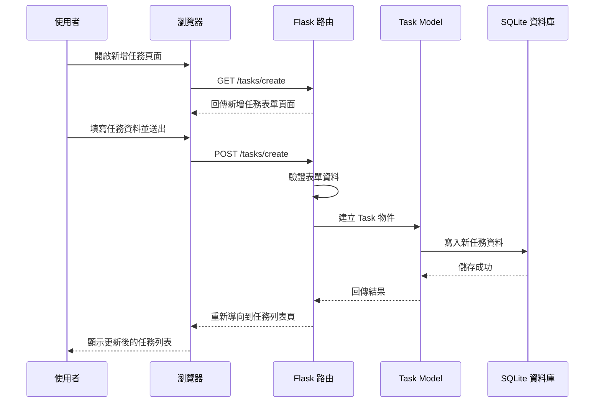

# 系統流程圖 (FLOWCHART)

根據 `docs/PRD.md` 與 `docs/ARCHITECTURE.md` 的規劃，以下為「食譜收藏系統」的使用者流程圖、系統序列圖與功能清單對照表。

## 1. 使用者流程圖（User Flow）

描述使用者進入系統後，如何與各個功能進行互動的操作路徑。本系統主要以首頁任務列表為入口，提供瀏覽、搜尋、新增、編輯、刪除與完成狀態切換等操作。

## 2. 系統序列圖（Sequence Diagram）

以下以「使用者新增任務」這個核心功能為例，描述資料從前端瀏覽器到 Flask 後端，再寫入 SQLite 資料庫的完整流程。

## 3. 功能清單對照表

對應本專案的所有功能，以下列出各個功能對應的 URL 路徑與 HTTP 方法。  
由於採用 SSR 架構，這些 URL 同時代表後端負責渲染畫面或處理表單送出的端點。

| 功能描述 | URL 路徑 | HTTP 方法 | 對應 View（Jinja2 Template） | 負責邏輯說明 |
|---|---|---|---|---|
| 首頁與任務列表 | `/` 或 `/tasks` | GET | `index.html` | 顯示所有任務列表 |
| 搜尋任務 | `/tasks/search` | GET | `index.html` | 根據 `q` 關鍵字搜尋任務名稱或內容 |
| 新增任務（頁面） | `/tasks/create` | GET | `create_task.html` | 顯示新增任務表單 |
| 新增任務（處理） | `/tasks/create` | POST | （處理後 Redirect） | 接收表單資料並寫入資料庫 |
| 任務詳細頁 | `/tasks/<id>` | GET | `task_detail.html` | 顯示單一任務的詳細資訊 |
| 編輯任務（頁面） | `/tasks/<id>/edit` | GET | `edit_task.html` | 顯示編輯任務表單並載入既有資料 |
| 編輯任務（處理） | `/tasks/<id>/edit` | POST | （處理後 Redirect） | 更新任務資料後返回詳細頁或列表頁 |
| 切換完成狀態 | `/tasks/<id>/toggle` | POST | （處理後 Redirect） | 將任務標記為完成或未完成 |
| 刪除任務 | `/tasks/<id>/delete` | POST | （處理後 Redirect） | 刪除指定任務後返回列表頁 |
| 篩選任務 | `/tasks/filter` | GET | `index.html` | 根據完成狀態顯示篩選結果 |